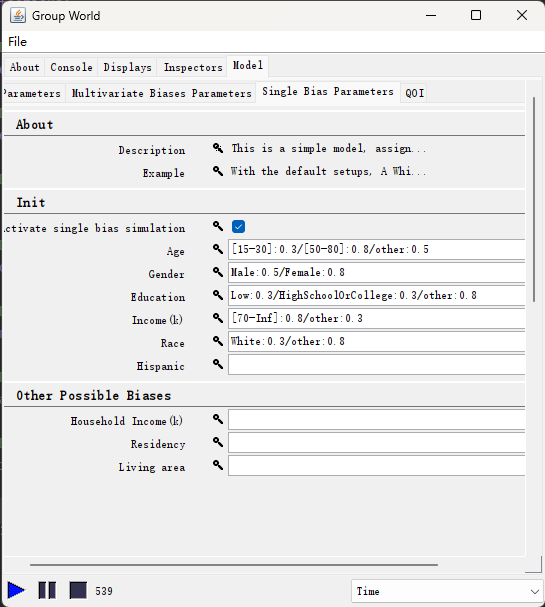
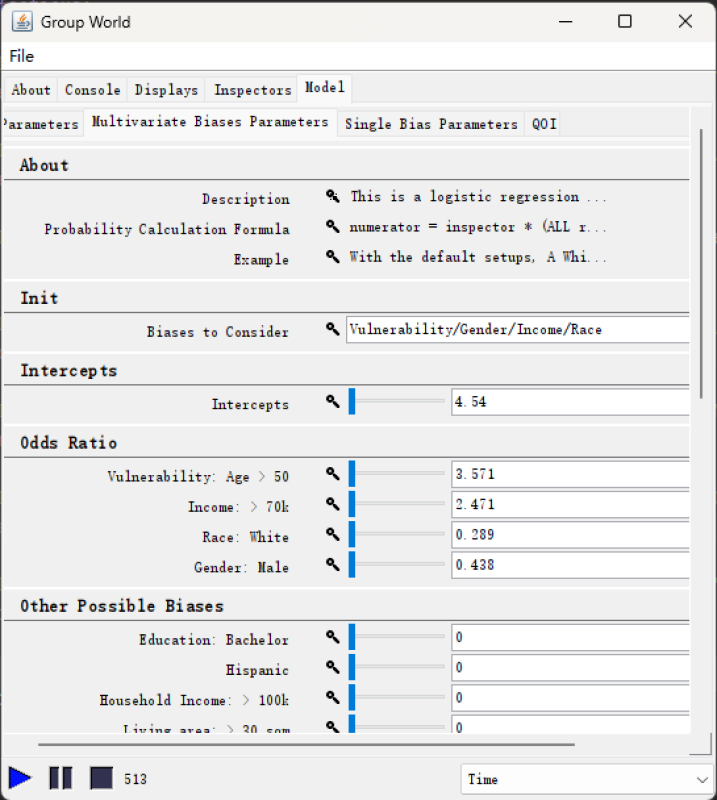

# Overview

This repository is the infectious disease simulation with biased data generator described in the paper 
***"An Infectious Disease Spread Simulation to Control Data Bias"*** currently under review. 
The demonstration video is available for download [here](demo.mp4), or on YouTube:
[](https://youtu.be/kqPduiHbLV4)

# Biased Data Simulation 
This simulation is an extension of the [*Patterns of Life
simulation*](https://github.com/azufle/pol), a scalable agent-based simulation of human
behavior that was recently used to generate large-scale and socially
plausible location-based social network data and trajectory
data. To simulate the spread of disease and the process of generating 
observational biased datasets, we extended the Pattern of
Life Simulation by adding the following features:
- An infectious disease model.
- Functionality to inform the simulation with real-world population census data, allowing to simulate any region
in the world where population census data is available.
- To generate biased observations, we provide the functionality to
adjust the proportion of different population groups reporting their cases when infected.
- To understand multivariate bias that is confounded by multiple population attributes
- We provide a demonstration of simulation and data generation for showcase at VLDB’24.


<!---
## Structure of project

The structure of the project and its summary are described as follows:
- [edu/gmu/mason/vanilla](src/main/java/edu/gmu/mason/vanilla): Core models including agents and needs
- [edu/gmu/mason/vanilla/db](src/main/java/edu/gmu/mason/vanilla/db): Classes related to schema
- [edu/gmu/mason/vanilla/environment](src/main/java/edu/gmu/mason/vanilla/environment): Environments such as a building and a building unit
- [edu/gmu/mason/vanilla/gui](src/main/java/edu/gmu/mason/vanilla/gui): Utilities related to GUI
- [edu/gmu/mason/vanilla/log](src/main/java/edu/gmu/mason/vanilla/log): Classes related to the logging system used to generate data
- [edu/gmu/mason/vanilla/utils](src/main/java/edu/gmu/mason/vanilla/utils): Other utilities
-->

## How to compile and build a jar file

The simplest way to compile the code is to import `pom.xml` as a Maven project. All dependent libraries are described in `pom.xml`. Most of library can be found in Maven Central Repository. However, there are four jar files you must set up manually before building your Maven project. The four jar files are located in [src/main/resources/libs/](src/main/resources/libs/). The following are commands that you can use to build local Maven repositories, assuming that Maven is installed in your computer.


```
mvn install:install-file -Dfile=src/main/resources/libs/jts-1.13.1.jar -DgroupId=com.vividsolutions -DartifactId=jts -Dversion=1.13.1 -Dpackaging=jar 
mvn install:install-file -Dfile=src/main/resources/libs/geomason-1.5.2.jar -DgroupId=sim.util.geo -DartifactId=geomason -Dversion=1.5.2 -Dpackaging=jar 
mvn install:install-file -Dfile=src/main/resources/libs/mason-19.jar -DgroupId=sim -DartifactId=mason -Dversion=19 -Dpackaging=jar 
mvn install:install-file -Dfile=src/main/resources/libs/mason-tools-1.0.jar -DgroupId=at.granul -DartifactId=mason-tools -Dversion=1.0 -Dpackaging=jar
```

You can create a single (executable) jar file by using the following command.

```
mvn org.apache.maven.plugins:maven-resources-plugin:2.6:resources \
org.apache.maven.plugins:maven-compiler-plugin:3.1:compile \
org.apache.maven.plugins:maven-assembly-plugin:3.1.0:single
```

It will generate `vanilla-0.1-jar-with-dependencies.jar` in directory `target`. It includes all dependencies.


## How to run a simulation

There are two ways to run a simulation: (1) GUI and (2) headless. For the GUI version, run the main method in `src/main/java/edu/gmu/mason/vanilla/WorldModelUI.java`.
For the headless version, invoke the main method in `src/main/java/edu/gmu/mason/vanilla/WorldModel.java` with appropriate arguments.

```
java [Log4j2-configuration] [log-directory] [inner-output-folder] [log-types] -jar [path to vanilla-0.1-jar-with-dependencies.jar] [simulation-configuration] [multivariate-bias-configuration] [single-bias-configuration] [simulation-stop]
```

`[Log4j2-configuration]`: In order to enable the logging mechanism designed in the project, you must add the following VM arguments.

```
-Dlog4j2.configurationFactory=edu.gmu.mason.vanilla.log.CustomConfigurationFactory
```

`[log-directory]`: Log output path directory. e.g., `logs`

```
-Dlog.rootDirectory=[root-directory]
```

`[inner-output-folder]`: Log output path directory in the root. e.g., `atl-80`
```
-Dfile.prefix=[inner-output-folder]
```


`[log-types]`: Logging types, `bias` set as default
```
-Dsimulation.test=[bias]
```


`[simulation-configuration]`: Model configuration file path

```
-configuration [filename]
```

`[multivariate-bias-configuration]`: Parameters for multivariate bias model. 
Example can be found in [bias.properties](bias.properties) as the default in GUI version.
```
-bias.config [filename]
```

`[single-bias-configuration]`: Parameters for single bias model. Example can be found in [bias.single.properties](bias.single.properties) as the default in GUI.
```
-bias.single.config [filename]
```

`[simulation-stop]`: At steps (Integer) to stop. e.g., `288`

```
-until [steps]
```


The following command was a complete example that uses all configurations.

```
java -Dlog4j2.configurationFactory=edu.gmu.mason.vanilla.log.CustomConfigurationFactory \
 -Dlog.rootDirectory=logs -Dsimulation.test=bias -jar target/vanilla-0.1-jar-with-dependencies.jar \
 -configuration atlanta.properties \
 -bias.config bias.properties -bias.single.config bias.single.properties -until 25920
```

Examples of configurations are found in [examples/](examples/).


## Load maps

Default maps are located in [src/main/resources/atlanta/](src/main/resources/atlanta/). 
The current version of this project includes three maps 
(i.e., [Atlanta downtown](src/main/resources/atlanta), 
[partial San Francisco](src/main/resources/san-fran), 
[Tianhe (Guangzhou, China)](src/main/resources/gz-tianhe)) complaint with simulation,
which requires the following four ESRI shapefiles:
- `buildings`: They represent 2D polygonal footprints of buildings. It should include `neighbor` (neighborhood id: Integer), `id` (building id: Integer), `function` (building type: Integer), and `degree` (attractiveness of building: Double) fields.
- `buildingUnits`: They are a unit in a building such as a restaurant and an apartment unit. They are a point object.
- `walkways`: It is a spatial network consisting of roads represented as a polyline. The network should be a connected graph.
- `region_census`: It contains the boundaries of each region as well as the corresponding census information. 
  - Regions (census tracts) boundaries could be found on [United States Census Bureau](https://www2.census.gov/geo/tiger/TIGER2020PL/STATE/).
  - Raw Census data could be found on [United States Census Bureau](https://data.census.gov/). 
  - The processed data should be formatted into range \[0,1\] representing the percentage of population over the region in each group of an attribute. `TopPop` is a special column, containing the percentage of population in a region over the entire selected map. \
  - Should have a `id` column in Integer, representing each region.
  - The current version supports the consideration of following attributes:
    - `Age Group`: 10 age groups, named as `AgeGroup0`, `AgeGroup1`, ... , `AgeGroup9`. The age starts at 15 and steps 5 years to the next group until 64.
    - `Education Level`: 5 education levels, named as `EduLevel0`, ... , `EduLevel4`. The education level consists with the source file [EducationLevel](src/main/java/edu/gmu/mason/vanilla/EducationLevel.java) used in the simulation.
    - `Race`: 7 races, named as `Race0`, ... , `Race6`. The races consists with the source file [Race](src/main/java/edu/gmu/mason/vanilla/Race.java).
    - `Gender`: Use binary genders. Provide the male proportion in `Male`
    - `Hispanic`: Provide the hispanic proportion in `Hispanic`.
    - `Household Income`: 7 household income groups, named as `Income0`, ... ,`Income6`. The split of the groups is specified in the source file [Region](src/main/java/edu/gmu/mason/vanilla/Region.java) through variable `incomeRanges`. The current set up is less than 10k, 10k-30k, 30k-60k, 60k-100k, 100k-150k, 150k-200k, and more than 200k.
    - `Individual Income`: 6 individual income groups, named as `IndiInc0`, ... ,`IndiInc5`. The split of the groups is also specified in the source file [Region](src/main/java/edu/gmu/mason/vanilla/Region.java) through variable `indivIncomeRanges`. The current set up is less than 10k, 10k-25k, 25k-50k, 50k-75k, 75k-100k, and more than 100k.


Note that multi geometry type such as multipoint and multipolygons are not supported. In order to load different maps, you have two options.
- Copy maps into [src/main/resources/atlanta/](src/main/resources/atlanta).
- Set the location of maps in the resources directory with parameter `maps`. For instance, you can load the San Francisco maps by setting `maps` configuration as follows.
```
maps = san-fran
```

Details of how to obtain these required files could be found in [doc of map](documentaion/map.md)


## Set model parameters

|                         GUI Windows                          |                            Single Bias Parameters                            |                         Multivariate Biases Parameters                         |
|:------------------------------------------------------------:|:----------------------------------------------------------------------------:|:------------------------------------------------------------------------------:|
| [](figures/gui.png) | [](figures/single_bias.png) | [](figures/multi_biases.png) |

All parameters can be changed in the bottom-right window in the figure *GUI Windows*.
The parameters are split into three tags, `Parameters`, `Single Bias Parameters`, and `Multivariate Biases Parameters`. 
The detail of each tag is as following:
- `Parameters`: The disease parameters and the general simulation parameters can be changed through this tag. An example of the corresponding file is [parameters.properties](parameters.properties) specified after `-configuration` when running without GUI. 
- `Single Bias Parameters`: The parameters used to control the model considering single bias. An example of the corresponding file is [bias.single.properties](bias.single.properties) specified after `-bias.single.config`. This model simulates reporting bias by directly assigning the reporting chance of agents with specific characteristics. For example, in the figure *Single Bias Parameters*, the line `[15-30]:0.3/[50-80]:0.8/other:0.5` implies that agents between the ages of 15 and 30 will have a 30% chance of reporting, agents between the ages of 50 and 80 will have an 80% chance, and all others will have 50% chance.
- `Multivariate Biases Parameters`: The parameters used to control the model considering multivariate biases. An example of the corresponding file is [bias.properties](bias.properties) specified after `-bias.config`. This model calculates the reporting chance of agents by a logistic regression model originally for mask usage prediction ([Von Hoene, Emma, et al.,2023](https://dl.acm.org/doi/10.1145/3615891.3628010)). We modified the model slightly, assuming an agent age over the age of 50 has a "perceived vulnerability > 50" (true), and ignoring the political variable, as these features are not available in the simulation. As shown in the figure *Multivariate Biases Parameters*, the considered attributes are specified under the `Init` separated by the symbol `/`. The intercepts and the odds ratios for the logistic regression model can be edited. As an example, a 16-year-old white male with a 20k income would have a reporting probability of $\frac{4.54 \times(3.571^0\times2.471^0\times0.289^1\times0.438^1)}{1 + 4.54 \times(3.571^0\times2.471^0\times0.289^1\times0.438^1)} \approx 0.365$.

## Output Dataset

Five files will be generated while running the simulation. Among them two are cached for execution and the other three include the necessary information. The three files are:
- `patterns_of_life.log`: It contains all information on the console. The summary of agents in each region is available in this file.
- `AgentCharacteristicTable.tsv`: It includes all unchangeable characteristics of agents (e.g. Race, Gender, Education Level). It also collects the reporting chances of each agent in column `reportingRate` and `reportingRates_Single`. The `reportingRate` is the chance calculated by the multivariate biases model, and the `reportingRates_Single` is the assigned rate by the single bias model.
- `DiseaseReports.tsv`: It provides disease spread information. The details are as following:
  - `regionId`: The region the agent belongs to.
  - `diseaseStatus`: Disease status in SEIR model (i.e. Susceptible, Exposed, Infectious, Recovered).
  - `byAgentID`: The agent that spread the disease.
  - `time`: The time the agent being infected and becoming Exposed.
  - `location` and `checkin`: The place the agent becoming Exposed. The former is the actual location in longitude and latitude format, and the latter is the function of this location (e.g. restaurant, home, work). 
  - `Report(Component)`: Binary value, representing whether the agent reported with the multivariate reporting chance.
  - `Report(Single)`: A string of bias types, seperated by `/`, representing in which considered bias types the agent reported. For example, `Age/EduLevel/Race` means the agent reported with reporting chances assigned by considering age, education level, or race, but didn't report in other considerations.
  
Current available datasets are in [examples/logs](examples/logs).